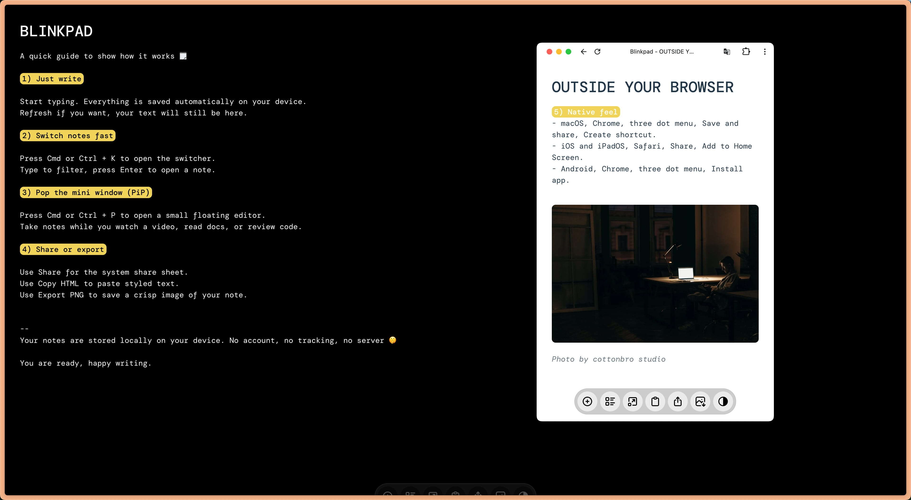

# Blinkpad

Blinkpad is a zero-friction, browser-native scratchpad for ideas that refuse to wait.
Keep it docked in the main window or float it on a second screen—every word stays in sync.



<p align="center">
  <a href="https://blinkpad.netlify.app" target="_blank"><b>▶ Try the Live Demo</b></a>
</p>

## Feature Highlights ✨

- Zero friction, open it, start typing, done.
- Autosave, your notes save themselves, even if you refresh.
- Sync across tabs, type in one window, see it in the other.
- Floating mini window (PiP), pull out a tiny editor to take notes while you watch, read, or review code.
- Easy share and export, use the system share sheet, copy as HTML, or export a crisp PNG.
- 100% local and private, nothing leaves your device.

### Shortcuts ⌨️

- Open the new note form Cmd or Ctrl + J
- Open the note switcher Cmd or Ctrl + K
- Open the floating mini window Cmd or Ctrl + P
- Highlight text Cmd or Ctrl + B
- Italic text Cmd or Ctrl + I
- Wavy text Cmd or Ctrl + U

### Pro tips

- Keep an Inbox note for quick dumps, organize later.
- Use short titles at the top of notes, it makes searching faster.
- Export a PNG of your note to drop it into a slide deck.

### Install Blinkpad like an app

Blinkpad works great as a pinned tab. If you prefer a native feel, install it from your browser.

- macOS, Chrome, three dot menu, Save and share, Create shortcut.
- iOS and iPadOS, Safari, Share, Add to Home Screen.
- Android, Chrome, three dot menu, Install app.

### Quick FAQ

**Where are my notes stored?**
On your device, locally. Nothing is sent online.

**What if I lose my connection or refresh the page?**
No problem, everything is already saved locally.

**I do not see the mini window, what now?**
Your browser might not support it yet. Try a recent version of Chrome.

### Privacy

Your notes stay with you. No account, no tracking, no server.

## Run locally

```bash
npm install
npm run dev
```

### Build

```bash
npm run build
```

### Preview

```bash
npm run preview
```

## Tech Stack Cheatsheet

- **TypeScript + Vite** power the build, keeping the runtime lean and the DX smooth.
- **@plainsheet/core** provides the animated bottom sheet foundations for libraries and new-note flows.
- **BroadcastChannel** synchronises content between windows, while **lz-string** compresses storage payloads.
- **DOMPurify** sanitises user input for safety; **html2canvas** handles high-fidelity PNG exports.
- **Microtip** sprinkles accessible tooltips across the navbar controls.

## Contributing

Have an idea, edge case, or design tweak for Blinkpad?
Open an issue, start a discussion, or ship a pull request—everything from copy polish to PiP enhancements is welcome.

## License

GPL 3.0, see COPYING.md.
